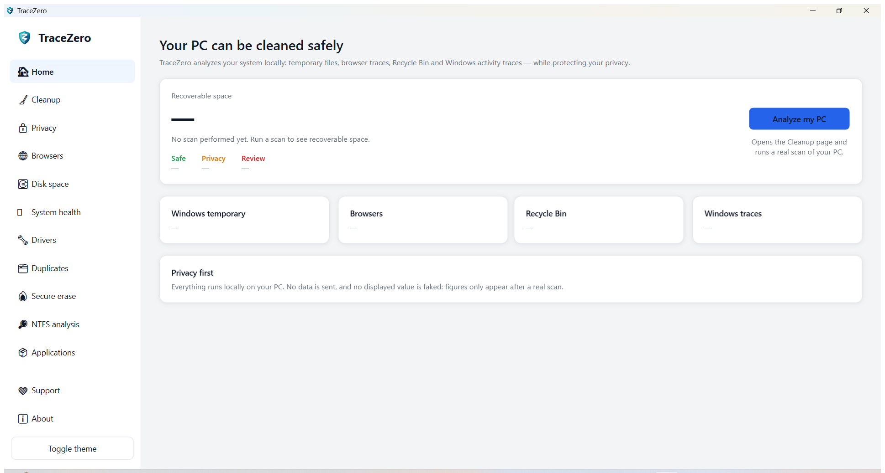
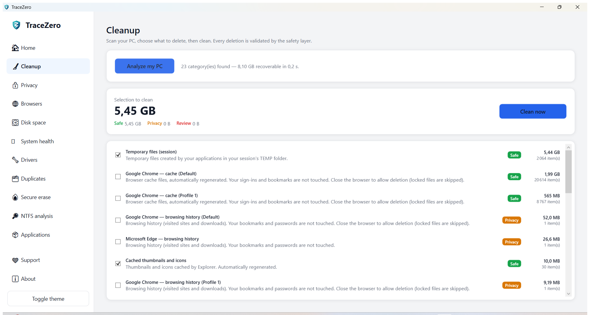

<p align="center">
  
</p>

<h1 align="center">TraceZero</h1>

<p align="center"><em>Voyez ce qui reste. Nettoyez ce que vous choisissez.</em></p>

<p align="center">
  <a href="LICENSE"></a>
  
  
  <a href="https://github.com/Sharkade02/tracezero/releases"></a>
</p>

<p align="center"><a href="README.md">English</a> · <strong>Français</strong></p>

TraceZero est un logiciel Windows de **nettoyage, confidentialité, gestion d'espace disque et
maintenance**, conçu pour rivaliser réellement avec CCleaner et PrivaZer — mais **local-first,
privacy-first, sans publicité, sans dark pattern et sans promesse mensongère**.

> **Philosophie :** aucune valeur affichée n'est simulée ; les chiffres n'apparaissent qu'après une
> analyse réelle. Aucune suppression n'a lieu sans passer par une couche de sécurité qui refuse par
> défaut. L'application ne démarre **jamais** en administrateur.

## Captures d'écran

| Accueil | Nettoyage (par risque, opt-in) |
|:---:|:---:|
|  |  |

## Télécharger

- **Version portable (aucune installation)** :
  [dernière release](https://github.com/Sharkade02/tracezero/releases/latest) → décompressez
  `TraceZero-portable.zip`, lancez `TraceZero.App.exe`.
- **Via winget** : `winget install TraceZero.TraceZero`

> **« Éditeur inconnu » au premier lancement ?** C'est normal : TraceZero est distribué directement
> (hors Store) et n'est pas encore signé par un certificat payant. Vérifiez l'empreinte **SHA-256**
> publiée avec chaque release, puis *Informations complémentaires → Exécuter quand même*. Détails et
> raisons : [`docs/download.md`](docs/download.md).

## Soutenir le projet

TraceZero est **gratuit, open source (MIT)**, sans publicité. Le soutien est **volontaire, au prix que
vous voulez** — aucune fonctionnalité n'est bloquée derrière un paiement.

➡️ **[paypal.me/sharkadeFR](https://paypal.me/sharkadeFR)** — ou l'onglet **Soutenir** dans l'application.

## Fonctionnalités

- **Nettoyage Windows** — fichiers temporaires, rapports de plantage, WER, caches, Corbeille (règles
  user-scoped, tailles réelles, prévisualisation par risque).
- **Confidentialité** — « ce que Windows sait encore de votre activité » : documents récents, RunMRU,
  chemins tapés, recherches, UserAssist… chaque trace expliquée, nettoyage registre allowlisté.
- **Navigateurs** — Chrome/Edge/Brave/Vivaldi/Chromium/**Opera/Opera GX**/Firefox : nettoyage des
  **caches SAFE** + **historique/cookies/sessions** en option (jamais cochés par défaut). L'historique
  Firefox est supprimé de façon **ciblée** (favoris préservés). Mots de passe et favoris jamais touchés.
- **Espace disque** — occupation des lecteurs, recherche de gros fichiers, envoi à la Corbeille
  (réversible).
- **Doublons** — détection fiable (taille → hash partiel → SHA-256), stratégie « garder le plus récent ».
- **Applications & démarrage** — désinstallation via l'éditeur, gestion réversible du démarrage.
- **Mises à jour logicielles** — via **winget** (source officielle signée), jamais de scraping.
- **Santé système** — santé disque (SMART/WMI) + impact au démarrage mesuré par Windows.
- **Pilotes** — inventaire lecture seule ; mises à jour déléguées à Windows Update.
- **Effacement sécurisé** — fichiers et espace libre, avec avertissement honnête SSD/NVMe.
- **Protection / Restauration** — sauvegarde des traces registre avant nettoyage, restauration réversible.
- **Analyse NTFS (Expert)** — traces expliquées, en lecture seule.
- **Automatisation** — profils Sûr/Confidentialité via le Planificateur de tâches, mode headless.
- **Multilingue** — interface complète en **français, anglais, allemand, espagnol** (bascule à chaud ;
  au premier lancement, la langue de Windows est suivie automatiquement).
- **Accessibilité** — focus clavier visible, `AutomationProperties`, aucun statut par la couleur seule.

## Sécurité — non négociable

- Toute suppression passe par `ISafePathValidator` (refus prouvé de `C:\`, profil, dossiers
  système/personnels, wildcard, traversal, UNC, jonctions/reparse points) — cf. `TraceZero.SafetyTests`.
- L'énumération ne suit jamais les jonctions/liens ; les fichiers verrouillés sont signalés, jamais forcés.
- Suppressions réversibles (Corbeille) quand possible ; jamais auto-sélectionnées.
- **L'app n'est jamais admin.** L'élévation passe par un helper séparé (`TraceZero.Elevated.exe`,
  manifeste `requireAdministrator`, single-shot, vocabulaire fermé) qui ne fait jamais confiance à l'UI.

## Stack & architecture

**.NET 10 · WPF · MVVM** (CommunityToolkit.Mvvm) · Generic Host (DI/logging). Code en anglais, UI en
français par défaut. Découpage en couches (voir `DECISIONS.md`) :

```
Domain       modèles purs, aucune dépendance
Application  interfaces de services
Engine       scan/clean, ISafePathValidator (portable, testable)
Windows      providers Windows (registre, WMI, EventLog)
Storage      lecteurs, santé disque (WMI)
Browsers     détection navigateurs
Persistence  SQLite (historique, coffre de restauration, licence)
Updater      vérification de manifeste signé
Elevated     helper admin séparé
App          WPF (composition root uniquement)
```

## Prérequis

- Windows 10 (19041+) / Windows 11, x64.
- **SDK .NET 10** (`winget install --id Microsoft.DotNet.SDK.10 -e`).

## Compiler & lancer

```powershell
dotnet build -c Release              # doit être 0 warning
dotnet test                          # suite complète
dotnet run --project src\TraceZero.App\TraceZero.App.csproj
```

### Build portable

```powershell
build\scripts\publish-portable.ps1   # produit artifacts\portable\TraceZero-portable.zip
```

En mode portable, un marqueur `tracezero.portable` à côté de l'exe fait stocker toutes les données dans
`<dossier>\Data` — aucune écriture cachée ailleurs.

### Pipeline release

```powershell
build\scripts\release.ps1            # restore + build/test Release + publish + SHA-256
```

Les portes externes (signature Authenticode, scan antivirus, tests VM) sont listées comme manuelles —
jamais simulées. Voir `docs/testing/VM_TEST_MATRIX.md`.

## Tests

`dotnet test` couvre : sécurité (`SafetyTests`, refus par défaut prouvé), moteur, Windows, navigateurs,
intégration (SQLite, updater, golden dataset §35) et performance (streaming, annulation, hashing).

## État du projet

Voir **`PHASE_STATUS.md`** (source de vérité de l'avancement), **`DECISIONS.md`** (ADR),
**`KNOWN_LIMITATIONS.md`** (limites honnêtes) et **`CLAUDE.md`** (guide de contexte). Toutes les
fonctionnalités sont livrées ; ne restent que des étapes dépendant d'**assets externes** (certificat de
signature, endpoint de mise à jour, validation en VM).

## Licence & distribution

Sous licence **[MIT](LICENSE)** (open source). Local-first, zéro télémétrie, zéro publicité. Le soutien
(PWYW) est **volontaire** : le nettoyage et la sécurité sont complets dans la version gratuite.

- Avertissement / non-garantie : [`DISCLAIMER.md`](DISCLAIMER.md)
- Confidentialité : [`PRIVACY.md`](PRIVACY.md)
- Notices tierces : [`THIRD-PARTY-NOTICES.txt`](THIRD-PARTY-NOTICES.txt)
- Stratégie de distribution (signature, winget, dons) : [`docs/distribution-strategy.md`](docs/distribution-strategy.md)
  et [`docs/RELEASE.md`](docs/RELEASE.md)
